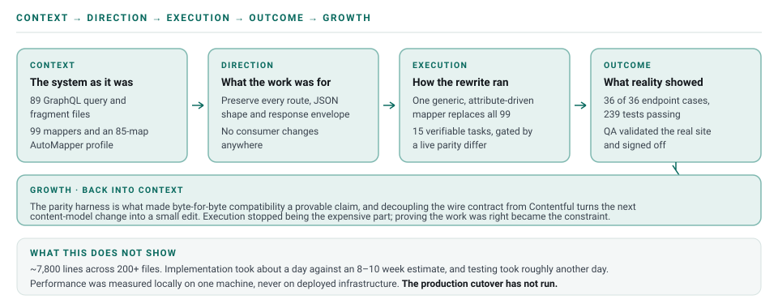

# Contentful API Migration

**Current CMS API (GraphQL) → Migrated CMS API (REST)** · .NET 9 MVC → .NET 10 Minimal API

## Summary

The CMS content API that powers the company's public website — pages, sections, blog, help center,
glossary — was rewritten from the ground up. A GraphQL integration against Contentful became a REST
integration against the Content Delivery and Preview APIs, and .NET 9 MVC controllers became .NET 10
Minimal APIs. The public contract stayed exactly where it was: every route, every JSON shape, every
response envelope, so no consumer had to change.

AI carried most of the rewrite. People set the direction and independently verified each result
against real, running systems. Both versions were deployed to UAT and the API gateway's preprod
endpoint was pointed at the new one, so **QA validated the real site against the migrated API and
signed it off**. The interesting part is how far AI lowered the barrier to attempting a rewrite this
size.

> **On "a day."** The **implementation** took about a day, run with agents and subagents. Testing and
> parity validation took roughly another day on top of that, and getting stakeholder agreement took
> longer still. The work was not continuous, and the calendar time from start to sign-off was
> materially longer than the execution time. The one-day figure describes **execution only** — it is
> not an end-to-end delivery time, and comparing it directly against an 8–10 week estimate that
> included analysis, review and coordination would overstate the gain.

> **What the evidence covers.** The parity harness, and QA's sign-off against the real site through
> the gateway. It does not cover the performance figures, which were measured locally (see Outcome).
> The production cutover has not run, so nothing here claims the migration has been observed under
> real traffic. The staged rollout below is the plan the evidence supports, and not a sequence that
> has already executed.

## How the cycle ran

---

## Context — the system as it actually was

The current API's live behavior was the reference for the rewrite, rather than its documentation or
the original plan. That distinction cost real time later, and it is why the parity harness reads
live responses instead of expected ones.

What the existing integration was made of:

- ~7,800 lines across 200+ files of hand-written, content-type-specific glue.
- 99 `Gql*` models and converters, plus a 1,246-line AutoMapper profile carrying 85 hand-written
  maps.
- A bespoke rich-text link resolver and a dynamic query builder.
- 89 `.graphql` query and fragment files, kept in lockstep by hand every time a content type changed.
- 2–3 GraphQL round trips per request, a general-purpose cache, minimal observability, and nothing
  standing between unknown-slug traffic and Contentful.

## Direction — what the work was for

A manual rewrite was estimated at 8–10 weeks of team effort. The question was whether AI, handling
the implementation under close human direction and verification, could reach the same result safely
in a fraction of that time. The point was to lower the barrier to the work, rather than to prove any
one person's or tool's prowess.

One rule was fixed before anything started, and every other decision was subordinate to it: **the
public contract could not change.** Routes, DTO shapes, the `CMSAPIResponse` envelope, JSON casing —
all of it had to survive the rewrite untouched, because the website and everything else calling the
API were outside the scope of the work.

The reasons to move:

- **The GraphQL integration was heavy and brittle.** Every content-type change meant hand-editing
  glue code in several places at once.
- **A recent denial-of-service incident** hammered the API with random, invalid slugs. The current
  API's architecture had no purpose-built defense against that pattern.
- **Caching was a general-purpose layer rather than a deliberate safety net.** Contentful's CDN is
  already fast. The cache only needed to exist as a last-known-good fallback for outages, instead of
  a read-through layer adding its own complexity and staleness risk.
- **Observability was thin.** Failures surfaced through customer reports more often than through
  metrics or alerts.
- **The stack was aging.** .NET 9 plus a hand-rolled GraphQL client was slower under load and harder
  to extend than a modern Minimal API stack.

## Execution — how the rewrite ran

AI carried most of the implementation. People made the calls and checked each result against real,
running systems before trusting it.

| | Before — Current CMS API | After — Migrated CMS API |
|---|---|---|
| Runtime | .NET 9, MVC controllers | .NET 10, Minimal APIs |
| Contentful access | GraphQL, 89 `.graphql` files, 2–3 round trips | REST Content Delivery/Preview API, 1 fetch + `include` |
| Mapping | 99 `Gql*` models + AutoMapper (85 hand-written maps) | 1 generic, attribute-driven `EntryMapper` (cached plans) |
| Caching | General-purpose cache | Fallback-only (fire-and-forget, circuit breaker, single-flight) |
| Abuse defense | None | Slug allow-list + Contentful webhook (unknown slugs rejected before any Contentful call) |
| Observability | Minimal | OpenTelemetry → Application Insights |
| Public API | 5 endpoint groups, versioned routes | **Identical** — same routes, same JSON, same envelope |

1. **Replaced per-type hand-written mapping with one generic engine.** A reflection-based
   `EntryMapper`, with compiled plans cached per type and driven entirely by attributes
   (`[ContentType]`, `[ContentfulField]`, `[RichText]`, `[Collection]`, …), replaced the 99 `Gql*`
   converters and the AutoMapper profile. A content-model change is now a DTO-attribute edit instead
   of a new converter.
2. **Broke the rewrite into 15 small, independently-verifiable tasks** — foundation, DTO contracts,
   the 5 content domains, the caching and resilience gateway, the DoS allow-list and webhook,
   observability, the validation harness, hosting and cutover, performance, payload optimization.
   Each was built, unit-tested, and merged only after an independent build and test check. There was
   never one giant rewrite.
3. **Built an objective parity harness as the real gate for correctness**, rather than manual review.
   A live differ called the current API and the migrated API side by side for every endpoint, backed
   by committed contract-snapshot ("golden JSON") tests. The differ was deliberately
   *additive-tolerant*: a new field never fails the check, and only a removed or changed value does,
   which matches how consumers actually break.
4. **Planned the rollout in reversible stages.** The gateway split meant the migrated API could be
   exercised under real conditions and reverted by repointing one route. A second Contentful webhook
   kept both services' allow-lists current during the transition, and the current API stayed warm and
   instantly reinstatable for the flip. The production flip itself has not been performed.
5. **Kept the judgment human** — for example, deciding which live differences were acceptable
   improvements and which were real regressions. Nothing was accepted on the AI's word. Each task's
   code, tests and live behavior were checked against the real, running systems before merging,
   rather than trusting generated code or documentation at face value.

## Outcome — what the environment showed

Three real defects surfaced before go-live, each caught by comparing live responses. Every one of
them sent the work back to reading the current system:

- Response JSON was briefly camelCase, following the original plan, when the current API's live
  responses were actually PascalCase with nulls included. Caught by diffing real responses, fixed
  everywhere.
- The new slug allow-list reused the sitemap's narrow 2-content-type list to gate *every* page
  lookup, which would have 404'd the homepage, FAQ, and Help Center landing page in production.
  Caught via live testing, fixed to cover all 8 page content types.
- Search was implemented against Contentful's full-text search, which matched far more broadly than
  the current API's slug/title/category/tag matching. Caught by comparing result counts,
  reimplemented to match the existing behavior exactly.

Checking did not stop at the API boundary. Both versions — current and migrated — were deployed to
the UAT environment, and the gateway's **preprod endpoint was pointed at the migrated API**, so the
actual website ran against the new service end to end while the current one stayed live and unchanged
for everyone else. **QA tested the site directly in that configuration and signed off.** Matching two
JSON responses shows the contract held. A QA pass against the running site shows the product still
works.

### Correctness and delivery

| Metric | Before | After |
|---|---|---|
| Live parity, Current vs. Migrated CMS API | — | **34/36** endpoint cases byte-for-byte; the other 2 differ by explicit approval |
| Endpoint groups verified side-by-side | — | **15/15**, zero errors, zero customer-visible differences |
| Site validated end to end through the API gateway | — | **QA tested the live site against the migrated API and signed off** |
| Automated tests | — | **239/239** passing (220 unit + 19 contract-snapshot), 0 build warnings |
| Security scan | — | 0 vulnerable dependencies, 0 hardcoded secrets, OWASP Top 10 clean |
| Implementation time | — | **~1 day** of execution with agents and subagents |
| Testing and parity validation | — | **~1 further day** |
| Stakeholder review and agreement | — | longer again; work was not continuous |
| Original estimate for the same scope | ~8–10 weeks of team effort | — |

The parity suite was a **one-time migration gate rather than a permanent CI check**. It was removed
from the pipeline once it had done its job, because it requires both services running side by side.
So 36/36 is a point-in-time result, and not a continuously enforced one.

### Performance — and what produced it

**These are local measurements.** Both services were run on one developer machine and driven by a
committed script: warm-up pass, then 400 requests at 40 concurrency across four representative
endpoints, plus a separate 120-request invalid-slug burst. **No load test has been run against
deployed infrastructure.** A proper multi-regime test was written and never executed, and the
comparison report it was meant to populate was never generated. Treat the direction as sound and the
multiples as indicative, not as production figures.

| Metric | Before | After |
|---|---|---|
| Throughput @ 40 concurrent | 7.6 req/s | **48 req/s (~6×)** |
| Help Center listing | 5.6 s | **345 ms (16× faster)** |
| Blog listing | 12.9 s | **1.9 s (6.8× faster)** |
| Typical content page | 667 ms | **189 ms (3.5× faster)** |
| Invalid / unknown-slug requests | ~70 ms (still reached Contentful) | **~8 ms**, rejected before any Contentful call |
| Response payload size | baseline JSON | **~63% smaller on average** (Brotli; up to 85% on the largest page) |

**The new architecture produced these gains. AI did not.** One REST fetch with `include` instead of
2–3 GraphQL round trips, a slug allow-list that rejects junk before it reaches Contentful, and Brotli
on a payload that had never been compressed. A team writing the same design by hand would have
measured the same gains. What AI changed was the cost of *attempting* the rewrite at all, which is a
claim about effort rather than about latency.

## Growth — what went back into Context

Beyond the running service, this is what the cycle left behind.

- **An automated, additive-tolerant parity harness is what made "byte-for-byte compatible" a
  provable claim.** Manual review would not have. It caught every real regression before a customer
  could see one.
- **Decoupling the wire contract from the source system** — DTOs plus mapping attributes, independent
  of Contentful's field names — turns a future content-model change into a small, low-risk edit
  instead of a new hand-written converter.
- **Small, independently-verifiable steps with a hard build and test gate at each merge** are what
  let AI carry the implementation quickly and safely, with people directing and verifying rather
  than writing the code by hand.
- **AI made this achievable with far less effort than the internal multi-week, multi-person estimate
  assumed.** The limiting factor was having an objective way to verify the changes. Engineering
  headcount was not the constraint. AI lowered the barrier, and the parity harness kept it safe.
- **Execution stopped being the expensive part, which moved the bottleneck rather than removing it.**
  Writing the code took a day. Proving it was right took another, and getting agreement to ship took
  longer than both. Any honest account of an AI speed-up has to say which of those it is describing.
- **A measurement needs its setting stated alongside it.** The performance figures here come from two
  processes on one machine. They are real and reproducible, and they are not production evidence.
- **A staged, reversible cutover** — shadow run, dual webhook, gradual flip, warm rollback target —
  means the migration will only ever carry as much production risk as each stage's own evidence
  justifies.
- The full history is traceable commit by commit in this repository's git log.
