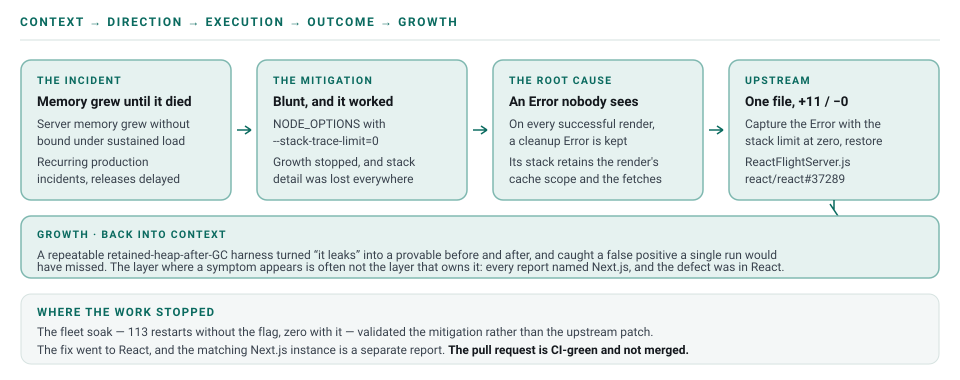

# A React Server Components Memory Leak, Traced Upstream

**Production OOM → workaround → root cause → validated fix → open-source contribution**

An AI-assisted investigation that kept going after the production incident was stabilized.

## Summary

A production Next.js 16 App Router application under real traffic was crashing with out-of-memory
(OOM) errors: server memory grew without bound under sustained load until the process died, causing
recurring production incidents and delaying releases. The immediate mitigation was a blunt workaround — a global Node flag (`NODE_OPTIONS=--stack-trace-limit=0`) that stopped the memory growth but also strips error-stack detail everywhere.

The workaround stabilized production, and the investigation continued. Rather than living with the
workaround, the leak was traced to its true source. It sat neither in the application nor in
Next.js's own code, but one layer deeper, in React's Server Components renderer (`react-server`, the
"Flight" server), and it was fixed there so that every consumer of the library could benefit.
This took **several days of repeated profiling**, and four plausible fixes were implemented and
disproved before the real one was found. AI carried much of the loop: building a minimal reproduction,
making the leak measurable, isolating the mechanism, writing the fix, and drafting the public
issue, pull request, and reproduction repository. That is what made a fix like this practical to
attempt at all. It still took human judgment to set the direction and to check each result against
real, measured behavior before trusting it.

The result is a personal open-source contribution, filed as a **CI-green pull request that is still
open and not merged**. The goal is broader than fixing one application: if the upstream fix is accepted, other applications using the affected React path can benefit without carrying the same workaround. It addresses the React instance of the anti-pattern; the same pattern exists
at a second site in Next.js, independently reported by another engineer, and is tracked separately.



*The visual is intentionally simple: stabilize the incident, continue the investigation, fix the underlying problem, and give the fix back to the ecosystem.*

## Context — what the systems showed

- **Unbounded server memory → OOM.** Under real traffic the application's memory climbed continuously
  and the process eventually crashed — producing production incidents and release delays. (Two kinds
  of evidence appear below and they are not interchangeable. The before-and-after retained-heap
  numbers come from a public reproduction. The pod-level object counts and the fleet A/B are
  observations of the private production system, so they can be described but not reproduced by a
  reader.)
- **The immediate mitigation was blunt.** `NODE_OPTIONS=--stack-trace-limit=0` bounded the growth but
  globally strips stack frames from every error, degrading observability across the whole service.
- **It wasn't only us.** The same symptom is widely reported publicly — e.g. `vercel/next.js#84648`,
  where server memory stays around 15 GB after a 40k-request load test in dynamic-rendering mode, and
  a partial Next.js fix in 16.0.3 did not fully resolve it. The real defect lived deeper than the
  application code.

### What the investigation took

The root cause did not arrive in one insight. It took **several days of repeated profiling**, and
most of that time was spent on explanations that turned out to be wrong.

**Even the mitigation was not obvious.** `--stack-trace-limit=0` was not an educated first guess; it
came out of testing Node flags one at a time against a measured heap curve. The result that mattered
was the one that *failed*: `--no-async-stack-traces` changed nothing in the isolated reproduction.
That pinned the reproduction's cause to **synchronous** stack-frame capture. (`--no-async-stack-traces`
is in any case rejected by `NODE_OPTIONS` outright, so it was never deployable fleet-wide.)

**Four plausible fixes were implemented and disproved**, each tested against loaded code rather than
reasoned about:

- Dropping the `stack` from `ResponseAborted` — no effect. Its stack is socket-close internals, not
  the render.
- Cancelling the dedupe clone in Next.js's `dedupe-fetch.js` — no effect.
- Nulling `task.model` and `task.thenableState` in React Flight's `abortTask` / `erroredTask` — no
  effect, and stderr instrumentation then proved those handlers **never fire** for the reproduction's
  leak.
- Application Insights as the retainer — A/B identical. A passenger rather than the cause.

**A measurement trap nearly produced a false positive.** A single light run sometimes drained to
~30 MB on its own, which made at least one wrong fix look like it worked. Only multi-round load
accumulated reliably, so every candidate had to be re-tested with the controlled four-round method
before it was believed.

**A local misconfiguration briefly produced the opposite false conclusion.** An extended burst run
showed the post-GC floor climbing 179 → 272 → 366 MB and was written up as a confirmed concurrency
leak. It was then traced to a dead local CMS endpoint in `.env.local` making every render's CMS fetch
reject. Against a healthy backend the identical test stayed flat at ~170 MB. The wrong setup had
accidentally been a faithful proxy for the production failure condition — useful, but only once it
was understood as such rather than reported as the baseline.

**It looked like a Next.js bug for most of the investigation.** Retainer analysis pointed at the
React `cache()` fetch-dedupe trie created by Next.js's `createDedupeFetch`, and the public symptom
reports were all filed against Next.js. Fixing it in Next.js changed nothing. What settled it was
instrumenting `global.Error` to enumerate **every** `Error` constructed during a request: the object
doing the pinning was created by React's Flight server, not by Next.js. The dedupe cache was what got
retained; React was what retained it.

### Two paths to the same pin

One mechanism produced the leak by two different routes, and conflating them wasted time. In both,
an `Error`'s **captured stack** references the request's `AsyncResource`, whose store holds React
Flight's `writtenObjects` — so a single retained `Error` drags an entire request's render graph with
it.

**On renders that fail** — the dominant path in production. When an SSR render errors or aborts
(dead-listing 404s, upstream failures against a saturated backend), the reason `Error` is retained by
a framework object: an `AbortSignal`'s abort reason, a Flight stream's closed-reason, or a rejected
promise. Heap analysis of a leaking production pod counted **8,833 aborted-with-reason
`AbortSignal`s** and **~1.96M retained promises** against **16** and **3,722** on a fresh pod —
roughly one pinned async render graph, ~210 promises apiece, per errored render.

**On renders that succeed** — the path the isolated reproduction exposed, and the one fixed upstream.
Even with no error anywhere in the request, React's Flight server constructs an `Error` *itself* on
the completion path to use as the cache-cleanup abort reason, and stores it for the request's
lifetime. This is the defect that does not depend on anything going wrong, which is why it was worth
fixing in React rather than in the application.

The application's own mitigations — a circuit breaker, a negative cache, and a concurrency cap —
reduced how *often* the first path fired but could not stop it, because they bound call rate and
in-flight work while the leak is retention that outlives request completion. Zeroing the stack limit
addresses both paths, because it removes the reference that does the pinning.

### Root cause

The leak is in React's `react-server` (Flight) renderer — `packages/react-server/src/ReactFlightServer.js`.

On **every successful render completion**, the server creates an internal cleanup signal:

- it constructs `new Error('This render completed successfully. All cacheSignals are now aborted ...')`
  and stores it as `cacheController.signal.reason`, held for the entire lifetime of the request;
- that `Error`'s captured **synchronous** stack retains — through its call-sites' closures — the
  completed render's cache scope, which includes the `cache()` fetch-dedupe entries that hold the
  fetch `Response` bodies.

So the response payload of every completed request is pinned in memory by the stack trace of an error
that is never shown to anyone. Under load — especially with clients disconnecting mid-render —
retained heap grows without bound until OOM.

The mechanism was corroborated independently: another engineer diagnosed the **same anti-pattern** —
an `Error` kept as an abort `reason` whose unread `.stack` pins the render's closure graph — at a
**different** code site (Next.js `dynamic-rendering.js`) in `vercel/next.js#97316`. Two independent
diagnoses of the same shape, in two files, are strong evidence the root cause is real rather than an
artifact of one setup. React already limits Flight stack capture elsewhere for exactly this memory
reason (#34864, #37086, #37158), so the fix fits an accepted, existing pattern.

## Direction — stabilize, then keep going

### The workaround was not the destination

`NODE_OPTIONS=--stack-trace-limit=0` was the practical production mitigation. It stopped the memory growth and restored stability, so it was useful and necessary. But it also globally disabled stack capture, reducing observability for unrelated errors.

The direction was set deliberately at the point the crashes stopped. Stopping the crashes was the
mitigation. The outcome worth reaching was understanding why disabling stack capture changed the
behavior, and finding out whether the underlying defect could be fixed without giving up stack
traces across the application.

## Execution — the fix and the contribution

The cleanup reason is internal and never surfaced to users, so it does not need a stack trace at all.
Create it with stack capture turned off, then restore the previous limit. As filed the change was one
file and **+11 / −0**; after community review it is two files and **+20 / −1**, because the toggle moved
into a `createErrorWithoutStack` helper with a `try/finally` — `Error.stackTraceLimit` is process-wide,
and a throw inside the block would otherwise leave every later stack trace in the process truncated —
and a regression test was added asserting the completion reason carries no frames.

| | Before | After |
|---|---|---|
| Cleanup abort reason | `new Error(...)` with a full synchronous stack | same `Error`, created with `Error.stackTraceLimit = 0` (saved/restored) |
| What the stack pins | the completed render's `cache()` scope + fetch `Response` bodies | nothing — no frames captured |
| Retained heap under load | climbs to OOM | flat |
| Rendered output | full response | **identical** |

```js
// Before — pins the render's cache scope for the request's lifetime
const abortReason = new Error('This render completed successfully. All cacheSignals are now aborted ...');
request.cacheController.abort(abortReason);

// After — benign, never-surfaced reason carries no stack
const previousStackTraceLimit = Error.stackTraceLimit;
Error.stackTraceLimit = 0;
const abortReason = new Error('This render completed successfully. All cacheSignals are now aborted ...');
Error.stackTraceLimit = previousStackTraceLimit;
request.cacheController.abort(abortReason);
```

This fixes the React (`react-server`) instance of the pattern. The Next.js instance
(`vercel/next.js#97316`) is a separate, complementary fix.

### How the work ran

AI did much of the legwork below — the reproduction, the analysis, the fix, and the write-ups —
which is what made this quick to do. It still took human judgment to steer the work and to check each
result against real, measured behavior, and nothing was accepted on the AI's word. What matters here
is the lowered barrier rather than the split of credit.

1. **Built a minimal, shareable reproduction.** A `force-dynamic` Server Component that awaits a slow
   upstream fetch and renders a large list, a load generator that disconnects clients mid-render, and
   a GC-probe endpoint to read retained heap on demand.
2. **Made retention measurable rather than anecdotal.** Controlled, multi-round runs that measure
   retained heap after a **forced GC** each round, turning "it leaks" into a repeatable before/after
   number.
3. **Formed and tested hypotheses until the mechanism was isolated.** Most were wrong, and each was
   tested against loaded code rather than argued about. Proved that only
   `--stack-trace-limit=0` (which disables **synchronous** frame capture) eliminated the growth, while
   `--no-async-stack-traces` did not — pinning the cause to synchronous stack capture. Confirmed with
   heap-snapshot retainer analysis showing retained `_Response` objects tracing back to the `cache()`
   dedupe map, then instrumented `global.Error` to enumerate every error constructed per request,
   which is what located the pinning object in React rather than Next.js.
4. **Implemented the fix** — create the never-surfaced cleanup reason with
   `Error.stackTraceLimit = 0` (save/restore) so it carries no stack.
5. **Authored the public issue, pull request, and reproduction repo** — forked, branched, committed,
   and pushed under a personal identity, and signed the contributor license agreement — all isolated
   from work identity and tooling.
6. **Did prior-art due diligence.** Searched both repositories, found the public symptom hub and the
   independent diagnosis of the same mechanism, deliberately avoided filing a duplicate, and
   cross-linked everything so the community can connect the reports, the repro, and the fix.
7. **Kept the judgment human.** Each claim — root cause, mechanism, fix efficacy — was checked
   against real, measured behavior before it was trusted, rather than accepting generated code or
   explanations at face value.

The work followed the four working stages. **Context** was reproducing the leak, isolating the mechanism, and gathering the evidence.
**Direction** was a production incident worth fixing at the root.
**Execution** was the focused fix and the upstream contribution path. **Outcome** was measured,
repeatable heap evidence plus independent corroboration. Each failed check sent the work back to Context rather than to another
attempt at a fix, which is the only reason the four wrong answers were ever ruled out.

## Outcome — validated under sustained load

The reproduction proved the mechanism in isolation. A later soak test proved it on a real fleet, and
by accident produced an unusually clean experiment: the **same container image** ran under load
twice, and the only difference in its environment was the stack-limit flag.

| | Flag absent | `--stack-trace-limit=0` |
|---|---|---|
| Pods under load | 53 | 36 |
| Restarts | **113**, up to 7 on a single pod | **0** |
| Failure mode | V8 heap OOM at ~4,044 MB against a 4,096 MB ceiling, confirmed in 14 crash logs | none |
| Per-pod heap growth | ~1–2 GB/min, unbounded | slow rise, then flat — one pod held 2,828 → 2,864 MB across 5.5 h |
| Duration survived | 2–4 minutes | ~6.5 hours, scaling 14 → 35 pods |

Corroborated independently: the load-test team's own dashboard tracks a per-pod request counter that
resets to zero whenever a pod restarts. Across the entire soak it climbed continuously with no
resets.

Two honest qualifications. First, this validates the **mitigation**, not the upstream patch — zeroing
the stack limit process-wide is exactly the blunt instrument the contribution exists to make
unnecessary, and it costs stack detail on every error in the service. Second, a forced-GC measurement
showed the surviving ~1.8 GB is genuinely retained rather than lazily uncollected. The leak went from
unbounded to bounded, which is what stopped the crashes; it did not go to zero.

### Results

| Metric | Before | After |
|---|---|---|
| Retained heap after forced GC (round 1) | 542 MB | ~68 MB |
| Retained heap, sustained | climbs 1141 → 1111 → 1615 MB → OOM | ~68–94 MB, flat over 8 rounds (160k reqs) |
| Rendered output | full 2000-item list, HTTP 200 | identical |
| Mechanism isolation | — | only `--stack-trace-limit=0` fixes it (synchronous frames) |
| Effort to root cause | — | several days of repeated profiling; four candidate fixes disproved |
| Fleet A/B, same image | 113 restarts across 53 pods | **0 restarts** across 36 pods, ~6.5 h under load |
| Fix size | — | 2 files, +20 / −1 (helper with `try/finally`, plus a regression test) |
| Independent corroboration | — | matching production diagnosis (`vercel/next.js#97316`), plus three independent reproductions on the pull request |
| Status | production mitigated via a global Node flag | upstream fix **open, not merged**; CI green, community review addressed, no maintainer review yet |

The two A/B arms ran different pod counts, 53 against 36, and the case study cannot reconstruct why.
Restarts per pod still separate the arms completely, but the denominators were not controlled.

**What the load evidence does not establish.** Every A/B here, including the independent ones, sets
`--stack-trace-limit=0` process-wide, which suppresses stack capture at every site rather than at this
one. What they establish is that captured stacks are the dominant retained cost on the client-abort
path. They do not isolate this single `new Error()` as the only contributor, and the fix should not be
expected to account for every megabyte the flag recovers.

**Independent reproductions since filing.** Three people arrived at the same result on workloads the
original reproduction does not cover. One ran four rounds of ~19,500 client-aborted requests per arm
with the whole protocol repeated: sixteen measurements without the flag landed between 407 and
2264 MB, sixteen with it between 68 and 157 MB, and the two sets never overlap. One ran a production
e-commerce storefront with real aborts — crawler timeouts, CDN origin timeouts, users navigating away
— and measured 650 MB retained above baseline against 118 MB, roughly 260 KB per aborted request
against 47 KB. Their residual 118 MB is unexplained and was still declining when they stopped. One has
shipped the same fix shape to their own production storefront.

**An open objection.** A React collaborator has pointed out that the regression test cannot prove the
leak is fixed: the test holds the signal in its own scope, so nothing can be collected regardless of
what the abort reason retains. The test asserts an invariant — the completion reason carries no
captured frames — rather than a reclaim. That reading is correct, and the reviewer who first endorsed
the test has since withdrawn that part of his endorsement. The effect is established by the
end-to-end reproductions, not by the unit test.

## Growth — what went back into Context

- **A measurable, repeatable harness turned "it leaks" into a provable before/after.** Multi-round
  retained-heap-after-GC applies the same discipline as the Contentful migration's parity harness,
  to memory instead of API shape. It also caught a false positive: a single run could drain on its
  own and make a wrong fix look correct.
- **The layer where a symptom appears is often not the layer that owns it.** Every public report
  named Next.js, and the retained objects belonged to a Next.js cache. The defect was in React. Being
  willing to keep going one layer down is what turned a local workaround into an upstream
  contribution.
- **AI can carry much of the investigation-to-PR loop** — reproduction → hypotheses → heap analysis →
  patch → upstream authoring — with people setting direction and validating each step. AI lowered the
  barrier to making this kind of contribution. It did not replace the engineering judgment.
- **A workaround resolves an incident. Root-cause analysis can resolve a class of problems.** The
  production mitigation stabilized the application, and continuing the investigation produced an
  upstream contribution that, if it is accepted, other consumers of the affected React path can
  benefit from.
- **Independent corroboration** — another engineer's production heap-snapshot diagnosis of the same
  anti-pattern at a different site — is strong evidence the root cause is real, not a quirk of one
  environment.
- **Prior-art due diligence is part of orchestrating a good contribution.** Do not duplicate,
  cross-link the existing reports, and provide the missing reproduction that ties them together.

## Public artifacts

- React issue: https://github.com/react/react/issues/37288
- React fix PR: https://github.com/react/react/pull/37289
- Reproduction repo: https://github.com/santhoshsathish94/react-flight-oom-repro
- Community reports: `vercel/next.js#84648` · `vercel/next.js#97316`
- Contributor: Santhosh Narayanan (`santhoshsathish94`)
