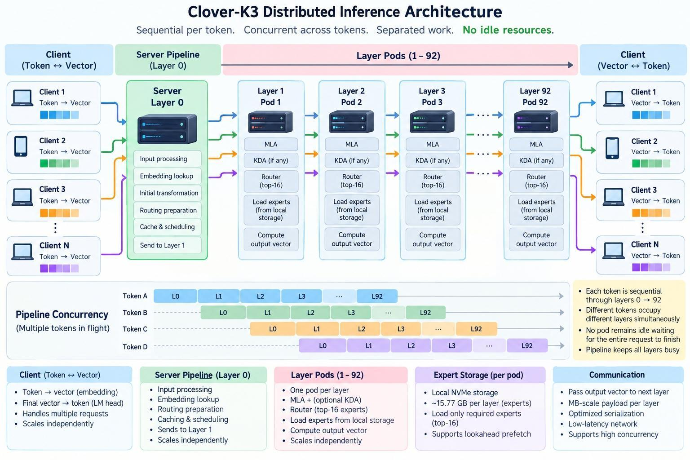

# Clover-K3 Scaling

**Status: proposed distributed design, not a deployed cluster.** The client owns embedding and model exit. The server owns Layer 0 and coordinates Layers 1-92. This boundary was confirmed on 2026-09-29.

Single-machine measurements inform the design; distributed correctness, throughput and recovery remain to be demonstrated.

## Reading path

- [Scaling overview](overview.md): sections 1-2.
- [Scaling architecture contract](architecture.md): sections 3-10.
- [Scaling resource sizing and evidence](resources.md): sections 11-14.
- [Scaling deployment validation](validation.md): section 15.

