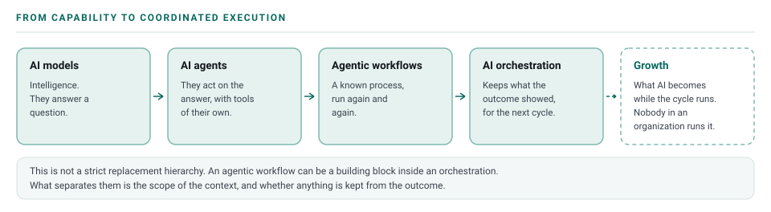

# The Clover Framework

## Purpose

Clover is a way of working with **System, Human, and AI to produce meaningful outcomes**, from the smallest possible use case to large and complex systems.

It does not claim to have invented the underlying pattern. Every system that worked has worked this way: somebody understood the situation, somebody decided what mattered and answered for it, the work got done, reality showed what happened, and what it taught carried into the next attempt.

AI does not replace the cycle. It can change how every part is expressed, sometimes making work easier or faster, and sometimes introducing new capabilities, risks, or failure modes. Capability belongs to the whole system: people, tools, access, memory, and verification. Improvement must be observed, not assumed.

What AI did change is that execution moved to something that cannot be accountable. Where execution went, accountability tended to follow, and in a lot of places it left the picture. Clover puts AI back inside the existing cycle as one of its actors, and puts accountability back where it can sit. AI capability may scale, but accountability cannot. AI cannot carry it, and it can make it visible.

The system is the reality, and the human and AI are the **actors**. **Context → Direction → Execution → Outcome → Growth** is the **system cycle** they run.

Prompts, tools, agents, and AI model choice all sit underneath the cycle. What the framework describes is how human intent becomes an outcome the environment shows, and what the next attempt starts from.

**The framework is five stages: Context → Direction → Execution → Outcome → Growth.**

These are related activities, not a mandatory sequence or a hierarchy. There is no privileged entry point or permanently most important stage. Enter where the work is; new evidence can change both Direction and Execution. This chapter defines the cycle, [principles](03-principles.md) its constraints, and [governance](../governance/08-governance.md) its controls. [AGENTS.md](../../AGENTS.md) is the self-contained operating specification for agents.

The first four produce a result. **Growth** is whatever that result taught, carried back so the next cycle starts from it. It needs no repetition and no scale: one wrong answer, understood and written down, is Growth. Growth closes the loop into Context.

## What makes Clover distinct

Naming five familiar activities is not what makes Clover worth using. Understanding, deciding, acting, and observing what happened exist in many engineering, operational, and management practices already.

The framework's useful claim is about accountability. Humans historically participated directly in execution, and the person doing the work was reachable when it went wrong. AI can now perform a growing share of that execution, and it cannot answer for any of it. The familiar activities have to be made explicit again so that the accountability which used to travel with the work does not disappear with it.

**The system is the reality, and the actors in it are the human and AI**: the system is the reality the work happens in, humans own Direction and accountability, and AI supplies capability and can take on execution.

**Context → Direction → Execution → Outcome → Growth** is the **system cycle** those actors run: understand the relevant reality, establish the desired outcome and boundaries, perform the work, observe what happened against reality, and keep what it taught.

The value of the framework is therefore not the invention of a sequence. It is making the boundaries and feedback between **reality, human purpose, AI execution, evidence, and learning** explicit enough to design and govern AI-enabled work.

Clover does not require a separate proof stage before people can use it. The underlying pattern predates AI. The AI-era question is what happens when more of the execution can be delegated while the same human Direction and system-based observation remain in place. **We can apply the cycle, preserve what meaningful cycles teach, and observe what emerges through adoption.**

Clover is therefore best understood as **a framework for working with System, Human, and AI to produce meaningful outcomes**, not a mandatory process for performing every task. Existing workflows, delivery methods, approvals, agent frameworks, and tools can remain in place.

## The system comes first

Clover is grounded in reality, not a ranking of actors:

**The system is the reality. The actors in it are the human and AI.**

The system comes first because it is where the outcome must exist. It may be an existing system, or the system we are trying to build. Its state, data, behavior, history, constraints, and evidence are the material the work must ultimately be grounded in, and the primary source of evidence for observing what happened.

The human owns Direction because purpose and accountability belong together. The human decides what matters, what outcome is worth pursuing, what makes that outcome meaningful, what constraints and boundaries apply, what must not happen, and what process or approach matters where that is part of the intended outcome. The human remains accountable for the outcome after delegating work.

AI provides knowledge, capability, and execution integrity; capability does not transfer accountability. AI can reason, recommend, plan, challenge, and execute, but Clover does not give AI ownership of Direction. Human and AI are complementary: neither possesses complete reality and neither is sovereign over it. Their disagreement is context to examine, not permission for either to disregard the governing boundaries.

AI is capable of making decisions. What Clover sets is a boundary on which decisions AI owns in a real-world system: **AI can determine how work happens within human Direction; it does not determine the Direction itself.**

## Capability may scale. Direction remains human.

Clover does not support transferring organizational Direction to AI, regardless of how capable AI becomes. AI may become dramatically better at reasoning, planning, implementation, coordination, and execution. None of that creates authority over purpose, acceptable risk, priorities, boundaries, or accountability.

Competitive pressure may encourage an organization to automate more of the path inside Execution. It does not justify handing AI the authority to decide what is worth pursuing.

> **Capability can increase. Authority does not have to.**

> **Do not transfer Direction to AI merely because AI becomes capable enough to perform it.**

Stated plainly: **the system is the existing reality that can validate the outcome, the human is accountable for that outcome against the purpose they chose to pursue, and AI can help reach it sooner by respecting the cycle.** A more capable AI can change the speed, cost, or quality of the work without changing what is worth pursuing.

This boundary also matters in critical situations. AI may be unavailable, delayed, rate-limited, or otherwise unsuitable when an organization needs to respond immediately. Production incidents and other high-blast-radius situations still require accountable humans and established operational mechanisms. Clover should improve the means of reaching an outcome without making the organization dependent on any particular AI service being available.

## Three leaves, then four, then five

The number of leaves carries the argument. The stages arrived in a different order than they run in, and the way they arrived helps explain what changed with AI.

### Three leaves — the common clover

Direction, Execution, Outcome. This is how work commonly happened before AI could execute substantial portions directly: a human established the Direction, humans or tools performed the Execution, and the result was observed. It works, and a lot of real value comes out of it.

Its Context is often bounded by what the people doing the work can reach, remember, collect, and hand over to the execution.

### Four leaves — the lucky clover

Context arrives, and it arrives first. It is no longer bounded by what one human remembered to provide. It can be the current system the work exists within or is being built within: repositories and documentation, datasources, logs and telemetry, deployment environments, running applications, tests, history, earlier attempts, and other relevant evidence.

That is why Context leads. The system exists before the request, so the material can be available ahead of the request rather than assembled from memory in response to it.

Direction is then given against what is actually there. Humans can point at the relevant part of the system instead of reconstructing the whole environment, and AI can use that context to determine the means of execution.

Reaching it takes a setup rather than a principle:

1. **Stand up read-only MCP servers** in front of the repositories, the datasources, the logs and telemetry, and the environments, so an agent can read them directly.
2. **Scope every connection to what the human driving the work already has access to**, at the privileges they already hold. Nothing new is being granted.
3. **Start with one environment. Development is enough.** Widen to other non-production environments as it proves out.

[The orchestration environment](../guides/orchestration-environment.md) covers what to connect and in what order, and [governance](../governance/08-governance.md) covers how that access is held.

The approach gets challenged, and the honest answer holds up. That access already exists and is already used, often with nobody tracking it. Clover makes it deliberate, scoped and visible. It also surfaces stale credentials, unreviewed access paths and data nobody has looked at, before any of those become an incident. [The questions a security team will ask](../governance/08-governance.md#questions-your-security-team-will-ask) are answered one by one.

Connecting the material does not finish the job. An organization's systems are a haystack and the thing worth finding is a needle somewhere inside it, and expecting AI to search the whole haystack does not work. **That is what changes Direction.** The people who work on a system every day know roughly where the needle fell, so Direction becomes a pointer at the part of the system to read first. Direction that points, together with context that is real, is what enables a meaningful Outcome.

It runs in a loop. What comes back from one pass is context for the next. Markdown files kept beside the work hold the summary, and that summary is what lets any agent pick the job up, so no single agent has to hold the work. [Context](05-context-engineering.md#where-context-lives) covers how those files are kept.

> After each favorable and unfavorable Outcome, the context files are written before the next attempt.

A lucky clover is the rare one, and this is the stage that makes it rare. It is also where organizations are now.

### Five leaves — the growth clover

Growth is the fifth stage. The first four produce a result; Growth is what the team does with what that result taught, so the next cycle does not start where the last one did.

It has a job, and it is small: **preserve what the cycle established, look across cycles for what repeats, and promote what held into practice the next cycle can start from.** Writing the context files after a favorable or unfavorable Outcome is the smallest version of it. Deciding that a pattern has held often enough to become a default is the larger one.

What gets written down and what gets reused are different bars. A single good result is an observation. A pattern earns promotion when it holds across repeated cycles.

A Clover cycle can produce useful learning from **every stage before it**:

- Context can reveal how the system actually behaves, what was previously unknown, and what information was missing.
- Direction can reveal which purposes, constraints, priorities, processes, or decisions produced favorable or unfavorable outcomes.
- Execution can reveal which approaches, tools, processes, or execution patterns work and which do not.
- Outcome can reveal what actually happened, what held, what failed, and what the evidence showed.

Favorable and unfavorable Outcomes are both part of Growth. An unfavorable Outcome is new information about reality. An analysis can expose a pattern. Understanding the current system can expose an assumption that was wrong. A favorable approach can become a reusable practice. Repeated cycles can reveal relationships that were invisible in one pass.

Growth can therefore happen at every layer participating in the system:

**Human.** Better understanding, judgment, expertise, and ability to create better Direction.

**AI.** Better performance from whatever learning, adaptation, memory, or refinement mechanisms are actually available to the AI system.

**System.** Better observability, clearer behavior, stronger tooling, improved architecture, and better ability to expose the information future cycles need.

**Team.** Shared practices, reusable knowledge, patterns, and better ways of working together.

**Organization.** Institutional knowledge, improved processes, better decisions, and accumulated Context that survives individual people and sessions.

**AI frontier.** Improvements to the underlying AI models through the training, evaluation, and refinement mechanisms controlled by frontier AI providers.

These layers do not have the same authority or control over learning. Clover does not claim that an AI provider trains on customer or enterprise work. Nor does it require a model to change before learning can occur around it.

The broader principle is:

> **When cycles repeat, patterns can emerge. When patterns are preserved, future cycles can improve.**

The model may remain the same while the human, team, organization, and system around it become better at using it. The underlying AI may also improve through frontier training and refinement, but that learning happens at a different layer and under different control.

Growth therefore does not belong to one actor. Preserving and promoting what a cycle taught is work a team does; what accumulates from it reaches across the **system, human, and AI**.

Everything below sets out the five stages one at a time, in the order they run.

## From AI models to AI orchestration

AI capability is evolving from models that provide intelligence, to agents that can act, to workflows that repeat and coordinate tasks, to orchestration that keeps what its Outcomes taught it.

This is not a strict replacement hierarchy. An agentic workflow can be an important building block inside an orchestration. What separates them is the scope of context and learning. A workflow runs a known process repeatedly. An orchestration captures what the Outcome showed and makes that available to the next cycle.

Context can accumulate at whatever scope fits — a human, a team, an organization, a system, or another defined boundary.

## The five stages

Each stage has one job. The complexity belongs in the context, ownership, evidence, and feedback around the stages, and not in adding more of them.

| Stage | What it is | Core question |
|---|---|---|
| **Context** | The relevant evidence about system reality needed for the current work — an existing system or the system being built, its data, behavior, history, constraints, evidence, and previous cycles. | What do we need to know about reality before acting? |
| **Direction** | The human establishes purpose, the outcome worth pursuing, priorities, constraints, boundaries, what must not happen, and accountability for the outcome. Direction can also point AI at where the relevant Context is and can include a process or approach when that itself matters to the intended outcome. | What needs to be done, what outcome is worth pursuing, and what must not happen? |
| **Execution** | AI uses human Direction as instructions and system Context as data to determine how the work should happen and execute within those boundaries. | How should the work happen? |
| **Outcome** | What the system or environment shows actually happened as a result of the Execution, whether favorable, unfavorable, partial, inconclusive, or otherwise different from what was intended. | What does reality show happened? |
| **Growth** | What the cycle taught, preserved where the next cycle will find it, and promoted into practice when it has held across enough cycles. | What did this teach, and what should the next cycle start from? |

A cycle can then run again. Growth is what carries one cycle into the next: what it preserves becomes part of the next cycle's Context. The Outcome may change the next Execution, and it may also change Direction when reality shows that a different outcome or constraint is now appropriate.

---

## Stage 1 — Context

Context is the relevant evidence about system reality that the work needs to reason from. It may describe a system that already exists, or the system we are trying to build.

The important distinction is that Context is not whatever a human happens to remember to put into a prompt. It is the relevant reality available from the system, together with history, evidence, previous attempts, and other information needed to understand the work correctly. Not everything available belongs in Context; relevance to the current Direction is the bar.

Direct system access does not mean unlimited context. More data can create noise, stale information, contradictory signals, and context-window pressure. **Filter before you hand off.** Prefer the smallest relevant set of trustworthy evidence that is sufficient for the current Direction, and summarize or reduce large sources before passing them into planning or execution.

In the common clover, context is only what one human can hand over — what they type, the files they attach, the repository they are working in. In the lucky clover it can include the current system itself: repositories and documentation, connected datasources, logs and telemetry, deployment environments, running applications, tests, history, earlier attempts, and what previous cycles wrote down.

**Core question.** What do we need to know about reality before acting?

**What the human holds.** Access and judgment. Which systems may be read, which data may be used, which sources can be trusted, where the answer probably is, and when the context in hand is good enough to act on.

**What AI does.** Most of the gathering. Reading code, tracing a call path, pulling telemetry, reconstructing an incident from logs, finding the earlier attempt nobody remembered, and writing back what the pass established so the next one starts from it.

The human's understanding is part of what the stage is for. They are working from memory of a system that has moved on since they last read it, and from context, human understanding can be improved by using AI to look at the relevant system information. Improving AI's own picture while leaving the human's where it was is half the stage.

**What happens there.** The plausible answer. An AI model working from thin context produces something that reads correctly and describes a system that does not exist. The opposite failure is hoarding, where a context packed with irrelevant material buries the few facts the problem turns on. [How AI fails](../guides/how-ai-fails.md) covers the specific patterns, and [context engineering](05-context-engineering.md) covers how the material is assembled.

---

## Stage 2 — Direction

Direction is where human purpose and accountability enter the system. The human decides what matters, what outcome is worth pursuing, what makes that outcome meaningful, the priorities, constraints, boundaries, what must not happen, and what remains their responsibility after delegation.

Direction may also specify an important process or approach when the human decides that how the work should be achieved is itself part of what matters. This does not transfer detailed execution to the human. AI still determines the operational path inside the stated boundaries.

Because the system is already readable, Direction can point instead of describing. A human can identify which service, workflow, dataset, or area of the system is most relevant rather than reconstructing the entire environment from memory.

A pointer is not permission to guess. When a human gives a high-level pointer such as a service, workflow, or dataset, preserve that Direction but surface important implicit constraints you can discover in the relevant Context. Ask when a missing constraint could materially change the safe or correct outcome. Do not invent domain policy, architectural invariants, or unwritten business rules merely to make the task look complete.

Clover does not give AI ownership of Direction. AI can sharpen a direction, ask questions, identify conflicts, surface risks, challenge assumptions, and recommend alternatives. It does not become accountable for deciding what outcome the system should pursue. A system operating on partial knowledge should not be allowed to define its own purpose in a real-world environment where even humans cannot fully understand every consequence.

Clover also does not make competitive pressure a basis for changing this boundary. A stronger model, a faster model, or fear of falling behind may change how much of **Execution** an organization chooses to automate. None of those things transfers **Direction** to AI.

**Core question.** What needs to be done, what outcome is worth pursuing, why does it matter, and what must not happen?

**What the human holds.** Purpose, priorities, the intended outcome, why it matters, constraints, risk boundaries, relevant pointers into Context, important process requirements, what counts as good enough, what stays out of scope, and accountability for the outcome.

**What AI does.** Clarifies and challenges Direction without owning it. AI can restate the objective, identify missing constraints, point out conflicts, and turn a vague request into something specific enough to execute. Once the rules are set it can hold them: say when an action is about to cross a boundary, decline the action, and keep the boundary visible to whoever the work passes to next. Holding a rule is not owning the Direction behind it, and AI never pursues a possibility on its own.

**Boundary examples.** Choosing to restore service within ten minutes is Direction; choosing which safe restart sequence is fastest is Execution. Requiring zero customer-data exposure is Direction; choosing a redacted log query is Execution. Deciding that a deployment may proceed only with a rollback path is Direction; selecting and executing that rollback path within the approved mechanism is Execution.

**What happens there.** Direction gets skipped because a ticket looks like enough, the work then optimizes for closing the ticket rather than the outcome, or an AI is allowed to choose the goal instead of determining the path toward a human-defined goal. Unstated scope is another failure: nobody said the change must not touch billing, so nothing stopped it.

---

## Stage 3 — Execution

Execution is where AI capability is applied to the combination of **human Direction and system Context**. AI uses the Direction as instructions and the Context as data to determine how the work should happen and execute within the boundaries established by the human.

Reasoning, planning, tool selection, AI model selection, orchestration across agents, code changes, tests, debugging, analysis, and interaction with the system all belong here.

Planning and doing sit on one stage on purpose. The plan can change when work meets reality, and adapting to new evidence is part of Execution rather than a reason to pretend the original plan was complete.

AI may execute tests and modify test code when the human explicitly directs that as part of the intended outcome. Otherwise, verification artifacts that help characterize the Outcome should remain outside the agent's writable Execution scope. Test fixtures, regression assertions, acceptance criteria, and other observation controls should be protected from silent weakening or deletion.

Humans and AI can share execution. The human retains the boundaries, approvals, and accountability even when AI performs most of the work.

**The boundaries bind both actors.** The system boundaries established in Direction are not a leash on AI alone. Neither the human nor AI may violate them, and a boundary is not removed by being ignored — it is removed by the human changing the Direction on the record.

Plan the smallest coherent path to the outcome. Run work in parallel only where it is genuinely independent, and replan when new information contradicts the current path.

---

## Stage 4 — Outcome

Outcome is where the system or environment shows what actually happened as a result of the Execution. It is deliberately broader than Success: the Outcome may be favorable, unfavorable, partial, inconclusive, or otherwise different from what was intended.

The evidence must connect to the human-defined intended outcome, but the fourth stage does not treat favorable evidence as the only meaningful endpoint. An unfavorable Outcome can reveal a false assumption, an unexpected system behavior, a missing constraint, or another fact that changes the next cycle.

Verification boundaries matter. Whenever possible, the evidence used to characterize the Outcome should come from a check the agent could not silently redefine while performing the Execution. Prefer protected test suites, independent fixtures, external assertions, separate environments, before/after measurements, production signals, or other validation mechanisms whose acceptance criteria remain outside the change being evaluated.

A passing test is only as meaningful as the integrity of the test and its acceptance criteria. Do not weaken, delete, bypass, or rewrite a verification control merely to make the Outcome appear favorable. If the verification control itself must change because the intended outcome or its acceptance criteria changed, make that change explicit in Direction and ensure the resulting Outcome is evaluated independently.

### Evidence should be attributable

Where the work matters, preserve a concise Outcome record: what intended outcome was evaluated, what evidence was used, what environment it came from, what changed, what was not changed, what actually happened, and where observation stopped. The record should be reproducible enough for another human or agent to understand the Outcome and why it was characterized that way.

Structured receipts can be useful when many agents or systems need to exchange Outcome information. They are an implementation choice rather than a stage of their own. A markdown context file may be sufficient for a small task; a structured record may be useful at larger scale.

The human holds the standard for what counts as sufficient evidence and remains accountable for the outcome. AI runs checks, gathers evidence, reports it accurately, and makes clear what it could not observe. The system or environment provides the reality against which the Outcome is judged.

When the evidence does not support the intended outcome, return to Context rather than repeating the same Execution. The unfavorable Outcome is information about reality and should change what the next cycle knows.

---

## Stage 5 — Growth

Growth is whatever the Outcome taught, carried back so the next cycle starts from it.

It does not need repetition, scale, or a threshold. A single cycle that answered a question wrongly
has produced Growth the moment somebody records why: the relationship that was misunderstood, the
assumption that turned out to be false, the signal nobody had looked at. That is the whole of it at
the smallest size, and it is the same stage at the largest.

Unfavorable Outcomes feed it as much as favorable ones, and often more. A cycle that disproved an
assumption has taught something a cycle that confirmed one did not.

What the stage does:

- **Keep what the cycle taught.** What was tried, what the environment showed, what turned out to be
  wrong, what is still unknown — written where the next cycle will find it rather than left in a
  conversation that ends.
- **Feed it back into Context.** Growth is not a separate store. What it keeps becomes the Context
  the next cycle reads, which is how the loop closes.
- **Notice what repeats, when it does.** Across cycles a pattern can appear — a recurring failure, an
  approach that keeps working, a constraint nobody wrote down. Naming it is useful. Making it a
  default is a human decision, and one good outcome is not yet a rule.

Growth is not reserved for scale. It is not something only frontier AI providers do with volumes of
interaction data, and it does not require a team, an organization, or a repeated pattern. One person,
one table, one wrong answer, one thing learned is Growth.

> **Any system that does not retrospect its growth will not produce better outcomes.**

**Core question.** What did this teach, and what should the next cycle start from?

**What the human holds.** The judgment about what is worth keeping, and accountability for anything
that becomes a default.

**What AI does.** Most of the writing back — recording what the pass established, what it could not
reach, and what contradicted an earlier assumption — and surfacing patterns across cycles that nobody
was tracking.

**What happens there.** The stage gets skipped, because the result is in and the work feels finished.
The next cycle then rediscovers what the last one already knew. The opposite failure is treating one
outcome as a rule.

Growth closes the loop. What it keeps is [Context](05-context-engineering.md) for the next pass.

---

## Delegated execution is an engineering decision

More execution can move from the human to AI as capability grows. That movement is not a maturity ladder, and it is not something that should increase merely because a model is more capable.

Decide what to delegate using five properties:

**Evidence** — has this kind of work held up before?

**Blast radius** — what happens if the action is wrong?

**Observability** — will we know quickly if it went wrong?

**Reversibility** — can we undo it cheaply and safely?

**Approval boundary** — does a human need to decide before it happens?

> **Delegate execution where evidence supports it, keep approval where blast radius demands it, and narrow delegation again when reality stops supporting it.**

Delegation is per context. A capability that is safe in development may be inappropriate in production. A model that performs reliably on one class of change may not be reliable on another.

The point is not to maximize how much work AI performs. The point is to use AI capability where it can contribute safely to the human-defined outcome.

---

## The claim Clover makes — and how to observe it

Clover does not ask to be accepted because its terminology sounds good. Its useful claim is simpler: making system reality, Human Direction, AI execution, and Outcome evidence explicit can provide a clearer way to work when AI performs more of the execution.

That does not create a proof gate before adoption. The underlying pattern predates AI, and the AI-era question is what happens when the execution layer changes. Teams can use the cycle and observe what emerges.

Useful observations include:

- Context is easier to inspect and less dependent on memory.
- Direction is clearer before consequential Execution.
- More execution can be delegated without obscuring accountability.
- Outcome claims are tied to evidence from the system or environment.
- Unfavorable Outcomes produce useful Context rather than repeated blind retries.
- Another human, agent, or session can continue without reconstructing the work.

These observations are not a required scorecard or a condition for using Clover. They are simply ways to notice what the approach produces in practice.

> **Apply the cycle. Preserve what it teaches. Observe what emerges.**

---

## Failure modes

Clover's common failure modes are predictable:

1. **Thin Context** — the agent acts on a request instead of the system.
2. **Context bloat** — the agent gathers everything and loses the relevant signal.
3. **Direction ambiguity** — the pointer is mistaken for permission to invent unstated policy.
4. **Execution overreach** — capability is mistaken for authority.
5. **Weak observation** — a local result or self-modified test is treated as proof of the intended outcome.
6. **Silent unfavorable-outcome repetition** — the same Execution is retried without learning.
7. **Lost continuity** — useful learning remains in one session instead of becoming Context for the next.

The answer to all seven is the same cycle, applied carefully: **Context → Direction → Execution → Outcome → Growth**, then carry useful learning into the next cycle.
